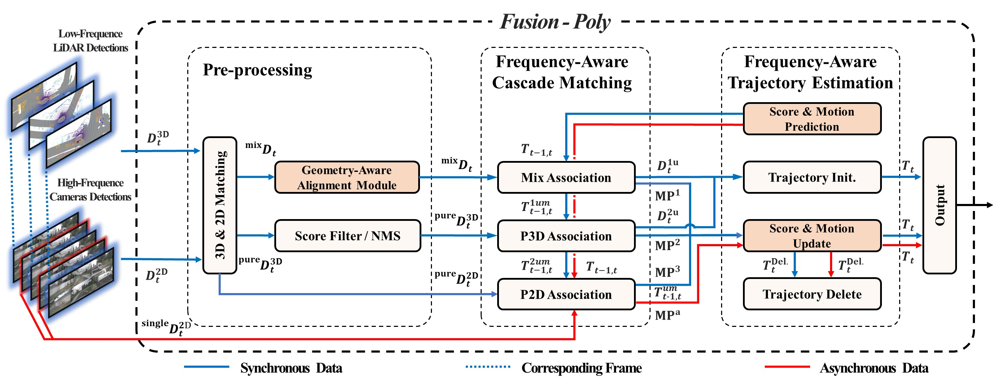

# Fusion-Poly

**Official Repository for the IROS 2026 Accepted Paper**

> [**Fusion-Poly: A Polyhedral Framework Based on Spatial-Temporal Fusion for 3D Multi-Object Tracking**](https://arxiv.org/abs/2603.08199),  
> Xian Wu*, Yitao Wu*, Xiaoyu Li*, Zijia Li, Lijun Zhao, Lining Sun  
> *arXiv technical report ([arXiv 2603.08199](https://arxiv.org/abs/2603.08199))*



Fusion-Poly is a learning-free LiDAR–Camera 3D multi-object tracking (MOT) framework that jointly performs cross-modal fusion and cross-frequency integration on nuScenes. It associates trajectories with multi-modal observations at synchronized timestamps and with camera-only observations at asynchronous timestamps, enabling higher-frequency motion and existence updates.

## Highlighted Results

| Split | Setting | Detectors | Input | AMOTA↑ | MOTA↑ | IDS↓ |
|-------|---------|-----------|-------|--------|-------|------|
| **test** | paper main | Mv2DFusion & Cascade R-CNN | C+L | **76.5** | 65.1 | 282 |
| **val** | high-freq (4 Hz cam) | CenterPoint & Cascade R-CNN | C+L | **77.1** | 67.3 | 416 |
| **val** | low-freq / sync. (2 Hz) | CenterPoint & Cascade R-CNN | C+L | **76.9** | 67.0 | 446 |

- Low-frequency (sync.): CenterPoint 3D + Cascade R-CNN 2D at the official nuScenes keyframe rate (**2 Hz**).
- High-frequency (async.): the same 2 Hz CenterPoint stream, plus Cascade R-CNN 2D densified to **~4 Hz** by inserting mid-interval camera frames between keyframes.

## Installation

```bash
conda create -n fusionpoly python=3.7 -y
conda activate fusionpoly
pip install -r requirements.txt
```

Or install from the provided Conda env file:

```bash
conda env create -f environment.yaml
conda activate fusionpoly
```

> Tracking / evaluation on CPU is sufficient. GPU is only needed if you regenerate Cascade R-CNN 2D detections with MMDetection.

## Data Preparation

### 1. nuScenes

Download [nuScenes](https://www.nuscenes.org/nuscenes) `v1.0-trainval` and set `--nusc_path` to the dataset root (the folder that contains `samples/`, `sweeps/`, `v1.0-trainval/`, ...).

### 2. Detection inputs (CenterPoint + Cascade R-CNN)

Download the prepared detection files from the project appendix
[[Google Drive](https://drive.google.com/drive/folders/1bUCXuWorg-vvcLo4BeOOcg27ZUiOnnWo?usp=sharing)]
(`trainval/` for val, `test/` for test). You do **not** need to regenerate CenterPoint or Cascade R-CNN outputs yourself.

Place (or symlink) them under `data/`:

```text
data/
├── detector/
│   └── val/
│       └── nuscenes_val_centerpoint_3d.json          # CenterPoint 3D on val
└── utils/
    ├── first_token_table/trainval/
    │   └── nuscenes_val_first_sample_tokens.json         # first sample token of each val scene
    └── cascade_rcnn_4hz/
        └── nuscenes_val_cascade_2d_4hz.json             # Cascade R-CNN 2D (key + mid frames)
```

Or pass absolute paths to `test.py`.

### 3. (Optional) How the 4 Hz camera stream is built

Official nuScenes annotations / keyframe tracking run at **2 Hz**. To form the paper’s ~**4 Hz** camera-only async stream, we insert one non-keyframe image per camera between consecutive keyframes, detect on those images, then interleave with keyframe 2D results.

**Step A — Non-keyframe token selection** (`data/script/detect2d.py`, mode `select_tokens` or `all`):

- Walk each scene from `nuscenes_val_first_sample_tokens.json`.
- Between two consecutive keyframe `sample`s, for every camera channel, pick the raw `sample_data` whose timestamp is closest to the interval midpoint (`--fractions 0.5`).
- Save the selected mid-frame camera tokens (used as the detection input list).

**Step B — Detection on mid-frame images** (same script, mode `detect` or `all`):

- Run the official MMDetection3D nuImages **Cascade Mask R-CNN (X-101_32x4d, 1x)** on the selected images:
  - Config: [`cascade_mask_rcnn_x101_32x4d_fpn_1x_nuim.py`](https://github.com/open-mmlab/mmdetection3d/blob/1.0/configs/nuimages/cascade_mask_rcnn_x101_32x4d_fpn_1x_nuim.py)
  - Weights: [`cascade_mask_rcnn_x101_32x4d_fpn_1x_nuim_20201024_135753-e0e49778.pth`](https://download.openmmlab.com/mmdetection3d/v0.1.0_models/nuimages_semseg/cascade_mask_rcnn_x101_32x4d_fpn_1x_nuim/cascade_mask_rcnn_x101_32x4d_fpn_1x_nuim_20201024_135753-e0e49778.pth) (listed in the [nuImages model zoo](https://github.com/open-mmlab/mmdetection3d/tree/1.0/configs/nuimages))
- These are also the defaults of `data/script/detect2d.py` (`--config_file` / `--checkpoint_file`).
- Write raw mid-frame 2D boxes to `<RAW_MID_DET_JSON>`.

**Step C — Concatenate with keyframe 2D** (`data/script/concat_2d_detection.py`):

- Convert / sort the mid-frame detections into the tracker format.
- Interleave them with keyframe Cascade results (`data/detector/nuscenes_val_cascade_2d_keyframe.json`) using the first-token table for sequence order.
- Mid-frame entries are keyed as `{keyframe_sample_token}_mid`.
- Output: `nuscenes_val_cascade_2d_4hz.json` (~2 Hz key + ~2 Hz mid ⇒ ~4 Hz camera stream).

Requires [MMDetection3D](https://github.com/open-mmlab/mmdetection3d) (≥1.0 nuImages configs) and the X-101 Cascade Mask R-CNN checkpoint above:

```bash
# Steps A+B: select mid-frame tokens and run Cascade R-CNN
python data/script/detect2d.py \
  --mode all \
  --fractions 0.5 \
  --nusc_path <NUSCENES_ROOT> \
  --sample_token_path data/utils/first_token_table/trainval/nuscenes_val_first_sample_tokens.json \
  --token_output_path <MID_TOKEN_JSON> \
  --detection_output_path <RAW_MID_DET_JSON>

# Step C: interleave keyframe 2D and mid-frame 2D
python data/script/concat_2d_detection.py \
  --nusc_path <NUSCENES_ROOT> \
  --high_rate_det_path <RAW_MID_DET_JSON> \
  --key_frame_det_path data/detector/nuscenes_val_cascade_2d_keyframe.json \
  --first_token_path data/utils/first_token_table/trainval/nuscenes_val_first_sample_tokens.json \
  --output_path data/utils/cascade_rcnn_4hz/nuscenes_val_cascade_2d_4hz.json
```

If you downloaded `nuscenes_val_cascade_2d_4hz.json` from the [Google Drive appendix](https://drive.google.com/drive/folders/1bUCXuWorg-vvcLo4BeOOcg27ZUiOnnWo?usp=sharing), you do **not** need to re-run this section.

## Run on nuScenes val

Working directory: repository root. Use `config/nusc_config.yaml` for low frequency and `config/nusc_config_high.yaml` for high frequency.

### Low frequency (sync. 2 Hz)

Uses only keyframe tokens. Mid-frame entries (`*_mid`) in the 2D JSON are skipped when `basic.freq: low`.

```bash
python test.py \
  --process 1 \
  --nusc_path <NUSCENES_ROOT> \
  --config_path config/nusc_config.yaml \
  --detection_3d_path data/detector/val/nuscenes_val_centerpoint_3d.json \
  --detection_2d_path data/utils/cascade_rcnn_4hz/nuscenes_val_cascade_2d_4hz.json \
  --first_token_path data/utils/first_token_table/trainval/nuscenes_val_first_sample_tokens.json \
  --result_path Fusion_Poly_EXP/result/nusc_config_low/ \
  --eval_path Fusion_Poly_EXP/eval_results/nusc_config_low/
```

### High frequency (async. 4 Hz camera)

Same CenterPoint 3D detections; the tracker also consumes mid-frame Cascade R-CNN 2D for association / lifecycle updates (`basic.freq: high`, `LiDAR_interval: 0.25`).

On async mid-frames, **existence scores** are updated with attenuated 2D confidence (paper Eq. 6), while **motion states** only run prediction plus a 2D measurement update under huge observation noise \(R=\gamma^{n}C\) (Eq. 3, \(n=1\)). With the default large \(\gamma\), the Kalman gain is ~0, so async observations do not pull the 3D trajectory state (same outcome as skipping the motion update).

```bash
python test.py \
  --process 1 \
  --nusc_path <NUSCENES_ROOT> \
  --config_path config/nusc_config_high.yaml \
  --detection_3d_path data/detector/val/nuscenes_val_centerpoint_3d.json \
  --detection_2d_path data/utils/cascade_rcnn_4hz/nuscenes_val_cascade_2d_4hz.json \
  --first_token_path data/utils/first_token_table/trainval/nuscenes_val_first_sample_tokens.json \
  --result_path Fusion_Poly_EXP/result/nusc_config_high/ \
  --eval_path Fusion_Poly_EXP/eval_results/nusc_config_high/
```

### Where to read metrics

After `test.py` finishes, open:

```text
<eval_path>/tracking/metrics_summary.json   # tracking metrics
<eval_path>/metrics_summary.json            # aggregated tracking + detection summary
```

## Render tracking results on RGB cameras

Render an existing `results.json` without running the tracker or evaluation:

```bash
python -m utils.viz --config config/viz_rgb.yaml
```

Edit `config/viz_rgb.yaml` for dataset/result/output paths, camera selection and
display options. Relative paths resolve from the repository root. By default,
only the first scene present in the results (sorted by scene name) is rendered,
with all six cameras and GT overlay enabled. Set `selection.scene_name` to a
specific scene, `selection.max_frames` to limit frames, and `selection.classes`
to e.g. `[car, pedestrian]` (`null` includes all seven tracking classes).
Set `selection.max_scenes: null` to render all available scenes.

Predictions use solid, stable per-ID colors and ID labels; GT uses white dashed
boxes. Top-left text is configured under `render.info_level` using `text_` keys
(camera, scene, zero-based frame index, threshold and sample token).
Object/GT labels are under `render.cube_level.text_*`; box options use
`cube_gt_overlay` and `cube_heading` in the same group. Text toggles do not disable
box geometry. `text_class` applies to both prediction and GT labels; `text_score`
applies only to prediction scores. `cube_gt_overlay: false` hides all GT geometry
and labels. The displayed threshold is the per-frame prediction score filter,
not an evaluation threshold. All display flags must be explicit YAML booleans.
Legacy flat `show_*` and `gt_overlay` options raise a migration error.
Each box is transformed
from global coordinates through the camera's ego pose and calibration before
projection; edges are clipped at the near plane and image boundaries.

Images are saved as `<output_dir>/<scene>/<camera>/<frame>_<sample_token>.jpg`.
`manifest.json` records configuration, source images, tokens, image sizes and
load/render timings. Repeating the same selection replaces the corresponding
images and manifest; unrelated existing images are retained.

This displays raw keyframe predictions and tracking-category GT annotations,
without evaluator filtering, track interpolation, or FP/FN/ID-switch matching.
Occlusion is not inferred. Object poses are not extrapolated to compensate for
small differences between camera and keyframe timestamps.

Raw detection overlays are controlled by `render.detection_level`:

```yaml
cube_2d_overlay: true
cube_3d_overlay: true
cube_heading: true
text_class: false
text_score: false
score_threshold_2d: 0.0
score_threshold_3d: 0.0
include_mid_frames: true
```

Set `paths.detection_2d_json` to the packed Cascade 4 Hz JSON and
`paths.detection_3d_json` to the CenterPoint submission JSON. The same
`selection.classes` filter applies to all layers. Detector confidence cutoffs
are independent of the tracking cutoff. Inputs are shown before tracker NMS,
fusion, association and state correction; an overlaid detection does not prove
that it was used in an update.

2D detections are cyan rectangles; 3D detections are magenta dashed cuboids.
GT remains white dashed and tracks retain ID colors. The second header line
shows enabled detector layers and cutoffs (`info_level.text_detection_legend`).
Set `cube_level.cube_tracking_overlay: false` and/or `cube_gt_overlay: false`
to isolate detections. Disabled detector inputs are not loaded.

`include_mid_frames` renders each packed `*_mid` entry on its actual camera
image in `<camera>_mid/`, with 2D detections only. These entries precede their
named keyframe: `000014_<token>_mid.jpg` is between keyframes 13 and 14.
No keyframe GT, track, or 3D detection is copied to that image. The camera and
timestamp interval are checked; source timestamps, frame types, visible box
counts and missing mid-frame entries are recorded in the manifest. Missing
keyframe detector entries raise an error rather than being treated as empty.

## Inspect val ID switches

```bash
python utils/inspection.py
```

Defaults use the high val result and its saved tracking metrics, writing to
`Fusion_Poly_EXP/inspection/nusc_config_high/`. Use `--result_path`, `--eval_path`
(the directory containing tracking `metrics_summary.json` and `metrics_details.json`),
`--nusc_path` and `--output_dir` to override paths. This tool supports **val only**.
It loads official evaluator filtering, track-mean scores and interpolation, then
matches once per class at the saved best-MOTA threshold. It does not rerun the
tracker, AMOTA sweep or RGB rendering.

`ids_events.json` stores each SWITCH with scene, zero-based keyframe index,
sample token, GT instance, previous/new prediction IDs and previous match frame.
`inspection_ranges.json` and `.txt` group nearby events for the same GT instance,
including the previous match and `--context_frames 5` keyframes of context.
Ranges are inclusive and sorted by IDS count. `--top 20` limits console output
only; report files always contain all events. Prediction IDs are scene-local.
The command checks classwise IDS/TP/FP/FN and total IDS against saved metrics;
a mismatch produces diagnostic files and exits with an error.

## Interactive Open3D inspection (base GUI)

```bash
conda activate fusionpoly-repro
python utils/viz_3D.py --config config/viz_3D.yaml
```

The base GUI opens **one scene** (`scene-0099` by default) from the saved high
tracking result. It loads LiDAR, GT (default on), tracks, raw 3D detections and
one selectable RGB camera with raw 2D detections. It does not rerun tracking or
evaluation. `config/viz_3D.yaml` controls paths, classes, score thresholds,
`info_level`, `cube_level`, and `detection_level`, following the RGB renderer.
Thresholds default to 0.2 for visual inspection; these are display filters,
not the classwise thresholds used by the IDS extractor.

Use left drag to orbit, Ctrl+drag to pan, and the wheel to zoom. The sidebar
provides previous/next, play/pause, a frame slider, camera selection, layer
toggles and reset view. With the canvas focused, Left/Right, Space and R provide
the same frame/play/reset controls. Frame indices are zero-based keyframe
indices within the scene. Track colors identify IDs; GT is white and 3D
detections are magenta. 2D detections are cyan in the RGB panel. The moving ego
axes are X red (forward), Y green (left), Z blue (up).

Coordinate modes transform **both origin and orientation**:

- `ego`: inverse of the current LIDAR_TOP ego pose.
- `world_first`: inverse of the first scene LIDAR_TOP ego pose, fixed for the
  entire scene, even when `start_frame` is nonzero.
- `global`: the nuScenes dataset global frame, with no recentering.

LiDAR points use `T_global_ego @ T_ego_lidar`. Saved 3D boxes are already global
(nuScenes width/length/height and quaternion w/x/y/z). Each RGB projection uses
that camera sample_data's ego pose and calibration, followed by its pinhole
intrinsics; near-plane/image clipping reuses `utils/viz.py`. Display coordinate
selection never changes camera projection. No motion extrapolation is applied
between the keyframe annotation time and individual camera acquisition times.
2D boxes have no metric depth and are not placed arbitrarily in the 3D canvas.

This first version displays the **2 Hz keyframes of the high result**. Async
`_mid` observations, intermediate states, trajectory history and IDS event
navigation are not implemented yet. Playback rate only controls the GUI clock.
The canvas PNG button saves geometry only; GUI text labels and the sidebar are
not included in that Open3D render export.

The tested environment uses Python 3.7 with `open3d==0.17.0` and
`nbformat==5.7.0` (see `requirements-viz3d.txt`). GUI acceleration uses hardware
OpenGL, independently of CUDA tensor support. Run in the graphical desktop
session with `DISPLAY` set. `glxinfo -B` must identify the hardware renderer;
the default config rejects a software renderer. The current environment has
already been installed and checked; no additional installation is needed.

```bash
# Dataset/transform validation without opening a window.
python utils/viz_3D.py --config config/viz_3D.yaml --validate-only
# Actual GPU GUI: visit all selected frames, test controls, save canvas, close.
python utils/viz_3D.py --config config/viz_3D.yaml --smoke-test
```

Validation checks every selected LiDAR frame and compares global-to-sensor GT
corners against the devkit for LiDAR plus all six cameras at the first, middle
and final selected frames. Projection errors are reported separately in pixels.
Reports and canvas exports go to `paths.output_dir`. Loading currently reads
the full metadata/results/detector JSON files, so startup and RAM usage exceed
the cost of stepping through the selected scene.

## Project Layout

```text
config/                 # only nusc_config.yaml (low) + nusc_config_high.yaml (high)
dataloader/             # nuScenes loader & fusion wiring
geometry/               # GAAM location coordinator, distances, boxes
motion_module/          # motion models / filters
pre_processing/         # NMS, 2D–3D data fusion
tracking/               # FACM / FATE / lifecycle / score management
data/script/            # Cascade R-CNN 2D generation & concat helpers
test.py                 # run tracking + official NuScenes evaluation
```

## Citation

If you find this work useful, please cite:

```bibtex
@inproceedings{wu2026fusionpoly,
  title     = {Fusion-Poly: A Polyhedral Framework Based on Spatial-Temporal Fusion for 3D Multi-Object Tracking},
  author    = {Wu, Xian and Wu, Yitao and Li, Xiaoyu and Li, Zijia and Zhao, Lijun and Sun, Lining},
  booktitle = {Proceedings of the IEEE/RSJ International Conference on Intelligent Robots and Systems (IROS)},
  year      = {2026}
}
```

## Acknowledgement

We thank the authors of the following open-source projects:

- [Fast-Poly](https://github.com/lixiaoyu2000/FastPoly)
- [EagerMOT](https://github.com/aleksandrkim61/EagerMOT)
- [CBMOT](https://github.com/cogsys-tuebingen/CBMOT)
- [CenterPoint](https://github.com/tianweiy/CenterPoint)
- [MV2DFusion](https://github.com/wangzt-halo/MV2DFusion)
